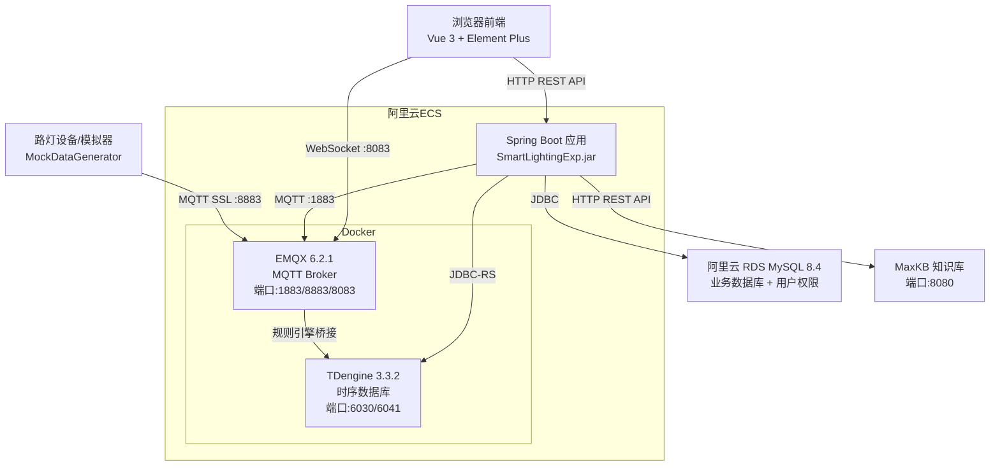
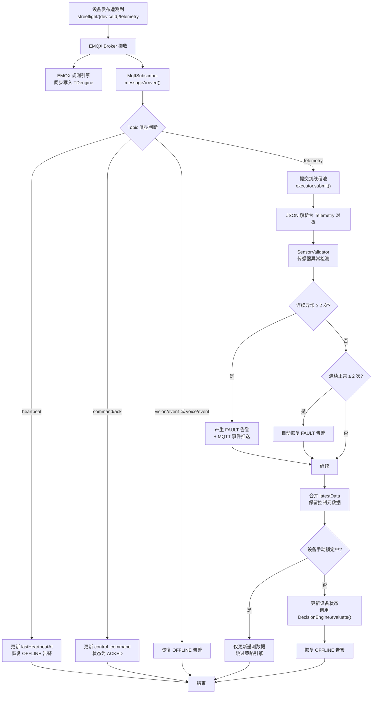
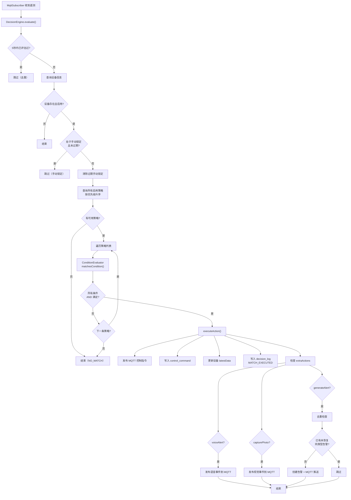
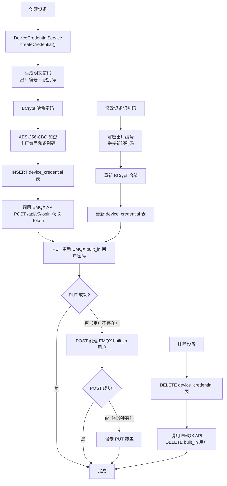
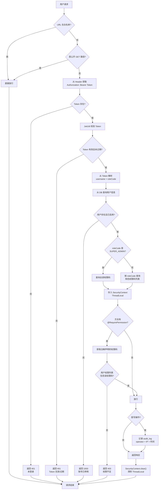
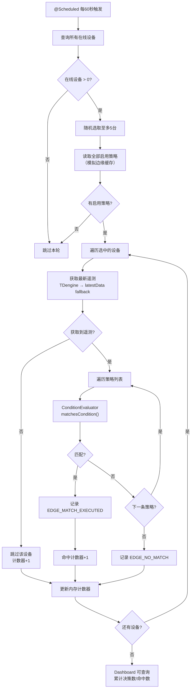

# 《企业项目实战》技术报告 — 第七、八章撰写方案

> 组长：谢云轩 | 项目：智慧路灯节能系统设计与实现 | 2026年7月12日

---

## 第七章 详细设计及实现

> 本章由组长谢云轩撰写，涵盖本人负责的云基础设施部署、中间件配置、MQTT通信层、策略决策引擎、设备鉴权体系、RBAC权限系统、边缘AI模拟及定时任务等核心模块。各模块包含设计思路、Mermaid流程图代码及关键配置/代码。

---

### 7.1 云基础设施与中间件部署

#### 7.1.1 设计思路

系统采用阿里云 ECS（Elastic Compute Service）作为运行主机，Docker 容器化部署 EMQX 消息中间件和 TDengine 时序数据库，阿里云 RDS MySQL 8.4 作为业务数据库。整体部署方案遵循以下原则：

- **容器隔离**：EMQX 与 TDengine 通过 Docker 隔离运行，共享自定义桥接网络 `iot-net` 实现容器间通信。
- **安全分层**：ECS 安全组控制端口暴露范围，EMQX SSL/TLS 加密设备 MQTT 连接，MySQL 密码通过 `.env` 文件注入。
- **高可用考虑**：Docker 容器配置 `--restart always` 策略，确保宿主机重启后服务自动恢复。
- **可观测性**：应用日志统一输出到 `/opt/smart-lighting/logs/`，EMQX Dashboard 提供实时连接监控。

#### 7.1.2 阿里云 ECS 安全组配置

| 端口 | 用途 | 协议 |
|------|------|------|
| 22 | SSH 远程管理 | TCP |
| 1883 | MQTT TCP 设备连接 | TCP |
| 8883 | MQTT SSL 加密连接 | TCP |
| 8083 | MQTT WebSocket 前端实时推送 | TCP |
| 8084 | MQTT WebSocket SSL | TCP |
| 18083 | EMQX Dashboard 管理后台 | TCP |
| 6030 | TDengine 原生连接 | TCP |
| 6041 | TDengine REST API | TCP |
| 6060 | TDengine Web 探勘器 | TCP |
| 8080 | MaxKB 知识库服务 | TCP |
| 3306 | MySQL RDS（通过白名单控制） | TCP |

#### 7.1.3 Docker 容器化部署

**Docker 网络规划**：

创建自定义桥接网络 `iot-net`，使 EMQX 与 TDengine 在同一网络内通过容器名互相通信：

```
docker network create iot-net
```

**EMQX 6.2.1 Enterprise 部署**：

```
docker run -d --name emqx \
  --restart always \
  --network iot-net \
  -p 1883:1883 -p 8883:8883 \
  -p 8083:8083 -p 8084:8084 -p 18083:18083 \
  -v /opt/smart-lighting/mqtt/emqx/data:/opt/emqx/data \
  -v /opt/smart-lighting/mqtt/emqx/log:/opt/emqx/log \
  -v /opt/smart-lighting/mqtt/emqx/etc:/opt/emqx/etc \
  emqx/emqx:6.2.1
```

**TDengine 3.3.2.0 部署**：

```
docker run -d --name tdengine \
  --restart always \
  --network iot-net \
  --hostname tdengine \
  -p 6030:6030 -p 6041:6041 -p 6060:6060 \
  -v /data/tdengine:/var/lib/taos \
  -e TAOS_FQDN=tdengine \
  tdengine/tdengine:3.3.2.0

docker network connect iot-net tdengine
```

**服务器部署目录结构**：

```
/opt/smart-lighting/
├── app/                          # Java 后端应用
│   ├── SmartLightingExp.jar
│   └── config/
│       ├── application-prod.yaml
│       └── logback-spring.xml
├── mqtt/emqx/                    # EMQX 持久化数据
│   ├── data/
│   ├── log/
│   └── etc/
└── logs/                         # 应用运行日志
    ├── info.log
    └── error.log
```

#### 7.1.4 EMQX 消息服务器配置

**SSL/TLS 证书配置**：

EMQX 启用 SSL 监听器（端口 8883），证书文件路径在容器内：
- 证书文件：`${EMQX_ETC_DIR}/certs/cert.pem`
- 私钥文件：`${EMQX_ETC_DIR}/certs/key.pem`
- CA 证书：`${EMQX_ETC_DIR}/certs/cacert.pem`
- TLS 版本：TLS 1.2, TLS 1.3
- 客户端证书验证：verify_none（不对设备端要求客户端证书）

**监听器状态**：

| 监听器 | 端口 | 用途 |
|--------|------|------|
| tcp:default | 1883 | 后端 MQTT 连接（backend 账号） |
| ssl:default | 8883 | 设备 SSL 加密连接 |
| ws:default | 8083 | 前端 WebSocket 连接 |
| wss:default | 8084 | 前端 WebSocket SSL 连接 |

**认证链配置**：

认证器采用链式结构，`built_in_database` 为主要认证方式：

| 配置项 | 值 |
|--------|-----|
| 认证链 | built_in_database（优先）+ MySQL（暂禁用） |
| 认证器1 ID | password_based:built_in_database |
| 后端类型 | EMQX 内置数据库 |
| 密码算法 | plain（明文） |
| 认证器2 | MySQL（BCrypt，暂禁用） |

MySQL 认证器禁用原因：EMQX 6.2.1 的 Erlang MySQL 驱动与 MySQL 8.4 的 `caching_sha2_password` 认证插件 + Prepared Statement 机制不兼容。

**ACL 文件配置（Topic 权限隔离）**：

```erlang
{allow, {username, "backend"}, all, ["streetlight/#", "system/#"]}.
{allow, {username, "dashboard"}, subscribe, ["$SYS/#"]}.
{allow, all, publish, [
    "streetlight/${username}/telemetry",
    "streetlight/${username}/heartbeat",
    "streetlight/${username}/vision/event",
    "streetlight/${username}/voice/event",
    "streetlight/${username}/command/ack"
]}.
{allow, all, subscribe, ["streetlight/${username}/control"]}.
{deny, all}.
```

ACL 设计要点：
- `backend` 服务账号拥有全部 Topic 的发布/订阅权限。
- `dashboard` 账号可订阅 `$SYS/#` 系统主题获取 Broker 指标。
- 设备账号（用户名=deviceId）使用 `${username}` 变量隔离，每台设备只能操作自己的 Topic，防止设备间数据串扰。
- 末尾 `{deny, all}` 作为默认拒绝规则。

**EMQX 规则引擎 — 数据桥接到 TDengine**：

在 EMQX 中创建规则引擎，将 MQTT 遥测/视觉/语音数据实时写入 TDengine 时序数据库。

连接器配置：

| 配置项 | 值 |
|--------|-----|
| 名称 | tdengine |
| 类型 | TDengine |
| 服务器地址 | tdengine:6041（容器名，同 iot-net 网络） |
| 用户名 | root |
| 密码 | taosdata |

遥测数据桥接规则 SQL（telemetry_bridge）：

```sql
SELECT
  payload.illuminance   as illuminance,
  payload.temperature   as temperature,
  payload.humidity      as humidity,
  payload.pm25          as pm25,
  payload.aqi           as aqi,
  CASE WHEN payload.pir >= -128 AND payload.pir <= 127
       THEN payload.pir ELSE NULL END as pir,
  payload.trafficFlow   as traffic_flow,
  payload.collectedAt   as ts,
  nth(2, split(topic, '/')) as dev_id
FROM
  "streetlight/+/telemetry"
```

动作 SQL 模板：

```sql
INSERT INTO t_${dev_id}
USING telemetry TAGS ('${dev_id}')
VALUES ('${ts}', ${illuminance}, ${temperature}, ${humidity},
        ${pm25}, ${aqi}, ${pir}, ${traffic_flow})
```

关键注意事项：
- 设备ID从MQTT Topic中提取 `nth(2, split(topic, '/'))`，不能依赖 `payload.deviceId`（EMQX 6.2.1 无法提取嵌套字段）。
- `pir` 字段加 CASE WHEN 校验范围（-128~127），防止超出 TDengine TINYINT 范围导致写入失败。
- 所有动作的"未定义变量作为 NULL"开关必须打开。
- 时间戳 `${ts}` 和字符串字段需加单引号。

视觉事件与语音事件的桥接规则同理，子表命名采用前缀区分：telemetry 子表 `t_`、vision_event 子表 `vis_`、voice_event 子表 `voi_`。

#### 7.1.5 TDengine 时序数据库

**数据库与超级表设计**：

```sql
CREATE DATABASE smart_lighting KEEP 365;

CREATE STABLE telemetry (
    ts TIMESTAMP, illuminance DOUBLE, temperature DOUBLE,
    humidity DOUBLE, pm25 DOUBLE, aqi INT, pir TINYINT, traffic_flow INT
) TAGS (device_id VARCHAR(50));

CREATE STABLE vision_event (
    ts TIMESTAMP, event_type VARCHAR(30),
    confidence DOUBLE, snapshot_ref VARCHAR(255)
) TAGS (device_id VARCHAR(50));

CREATE STABLE voice_event (
    ts TIMESTAMP, type VARCHAR(20),
    content VARCHAR(500), source VARCHAR(20)
) TAGS (device_id VARCHAR(50));
```

设计要点：
- 数据保留 365 天，到期自动清理。
- 超级表按 `device_id` TAG 分区，数据写入时使用 `t_${dev_id}` 子表自动创建。
- 三条超级表分别对应遥测、视觉、语音三种数据类型，物理隔离但查询可 JOIN。

#### 7.1.6 流程图：系统部署与数据流架构



---

### 7.2 MQTT 通信层设计与实现

#### 7.2.1 设计思路

MQTT 通信层是系统与设备之间的唯一消息通道，承担遥测数据上行、控制指令下行、心跳维护和事件推送职责。设计要点：

**后端 MQTT 客户端（MqttConfig）**：
- 使用 Eclipse Paho Java 客户端，单一 `backend` 服务账号连接 EMQX。
- SSL/TLS 加密连接（`ssl://47.96.27.141:8883`），trustAll 信任自签名证书。
- 自动重连（`setAutomaticReconnect(true)`），会话清理（`setCleanSession(true)`）。
- 连接超时 10 秒，KeepAlive 间隔 15 秒，最大并发消息 50 条（`setMaxInflight(50)`）。
- 客户端 ID 包含时间戳后缀，避免重启时因旧会话残留导致连接被拒。

**消息订阅（MqttSubscriber）**：
- 订阅 5 个通配 Topic：heartbeat、telemetry、vision/event、voice/event、command/ack。
- 遥测数据提交到 4 线程固定线程池异步处理，避免阻塞 Paho MQTT 接收线程。
- 心跳和 ACK 消息在当前线程直接处理（轻量操作）。
- reconnect 时在新线程中重新订阅，防止 Paho 回调线程死锁。

**消息发布（MqttPublisher）**：
- 使用 CachedThreadPool 避免单线程超时阻塞。
- 每次发布设置 5 秒超时，超时后后台继续尝试，不阻塞调用方。
- 未连接时跳过发布并记录警告日志。

**系统事件发布（SystemEventPublisher）**：
- 告警生命周期事件（created/acknowledged/resolved）通过 `system/alarms` Topic 实时推送到前端。
- 前端订阅该 Topic（WebSocket）实现告警实时刷新。

#### 7.2.2 流程图：MQTT 遥测数据处理



#### 7.2.3 关键配置/代码

**application.yaml MQTT 配置**：

```yaml
mqtt:
  broker: ssl://47.96.27.141:8883
  username: backend
  password: 123456
  client-id: smart-lighting-backend-v888
  topic-prefix: streetlight
```

**MqttConfig.java — SSL 信任所有证书的 SocketFactory**（`src/main/java/com/experiment/smartlightingexp/config/MqttConfig.java`）：

```java
@Bean(destroyMethod = "disconnect")
public MqttClient mqttClient(MqttProperties props) throws MqttException {
    String uniqueClientId = props.getClientId() + "-" + System.currentTimeMillis();
    MqttClient client = new MqttClient(
            props.getBroker(), uniqueClientId, new MemoryPersistence());

    MqttConnectOptions options = new MqttConnectOptions();
    options.setAutomaticReconnect(true);
    options.setCleanSession(true);
    options.setConnectionTimeout(10);
    options.setKeepAliveInterval(15);
    options.setMaxInflight(50);
    options.setUserName(props.getUsername());
    options.setPassword(props.getPassword().toCharArray());
    options.setSocketFactory(createTrustAllSocketFactory());
    options.setHttpsHostnameVerificationEnabled(false);

    client.connect(options);
    return client;
}

private static SSLSocketFactory createTrustAllSocketFactory() {
    TrustManager[] trustAll = new TrustManager[]{
        new X509TrustManager() {
            public void checkClientTrusted(X509Certificate[] c, String a) {}
            public void checkServerTrusted(X509Certificate[] c, String a) {}
            public X509Certificate[] getAcceptedIssuers() { return new X509Certificate[0]; }
        }
    };
    SSLContext sslContext = SSLContext.getInstance("TLSv1.2");
    sslContext.init(null, trustAll, new SecureRandom());
    return sslContext.getSocketFactory();
}
```

**MqttPublisher.java — 带超时保护的异步发布**（`src/main/java/com/experiment/smartlightingexp/mqtt/MqttPublisher.java`）：

```java
private final ExecutorService publishExecutor = Executors.newCachedThreadPool();

public void publish(String topic, String payload, int qos) {
    if (!mqttClient.isConnected()) {
        log.warn("MQTT 未连接，跳过发布 topic={}", topic);
        return;
    }
    Future<?> future = publishExecutor.submit(() -> {
        MqttMessage message = new MqttMessage(payload.getBytes(StandardCharsets.UTF_8));
        message.setQos(qos);
        message.setRetained(false);
        mqttClient.publish(topic, message);
    });
    try {
        future.get(5, TimeUnit.SECONDS);
    } catch (TimeoutException e) {
        log.warn("MQTT 发布超时 topic={}, 后台继续尝试", topic);
    }
}
```

---

### 7.3 策略决策引擎设计与实现

#### 7.3.1 设计思路

策略决策引擎（DecisionEngine）是系统的智能核心，负责根据实时遥测数据自动决定是否对路灯下发控制指令。设计遵循以下关键原则：

1. **触发时机**：MqttSubscriber 每次收到遥测数据且设备不在手动锁定状态时自动调用 `evaluate()`。
2. **手动锁定优先**：手动控制后 30 分钟内（`MANUAL_LOCK_MINUTES = 30`），AI 策略引擎跳过该设备，防止自动策略覆盖人工干预。锁定过期后由 MqttSubscriber 自动清除。
3. **评估去重**：同一设备 5 秒内不重复评估（`ConcurrentHashMap` 记录时间戳），防止线程池并发导致重复决策。
4. **优先级匹配**：查询所有启用策略，按 `priority` 升序遍历，首个命中即停止（短路匹配），实现"高优先级策略优先执行"。
5. **条件评估分离**：将条件判断逻辑抽离为 `ConditionEvaluator` 纯函数（零 Spring 依赖），确保云端 DecisionEngine 与边缘 EdgeNodeSimulator 使用完全一致的评估逻辑，保证边缘断网时的本地决策正确性。
6. **联动动作链**：策略命中后支持三种联动动作：
   - 语音播报（voiceAlert）：自动发布语音事件到 MQTT。
   - 自动拍照（capturePhoto）：自动发布视觉事件（拍照指令）到 MQTT。
   - 自定义告警（generateAlert）：自动创建告警并去重（同一设备同一类型已有未恢复告警则跳过）。
7. **故障容错**：MQTT 下发失败时记录 FAILED 状态的 control_command 和 MATCH_FAILED 的 decision_log，不影响其他设备的策略评估。

**ConditionEvaluator 条件支持**：

| 条件Key | 含义 | 示例值 |
|---------|------|--------|
| lux_lt | 光照强度小于 | 500 |
| lux_gt | 光照强度大于 | 1000 |
| temp_lt | 温度小于 | 40 |
| temp_gt | 温度大于 | 0 |
| humidity_lt | 湿度小于 | 80 |
| humidity_gt | 湿度大于 | 20 |
| pir | PIR 人体感应（0/1） | 1 |
| traffic_gt | 车流量大于 | 10 |
| traffic_lt | 车流量小于 | 5 |
| time_range | 时间范围 | 18:00-06:00 |

条件评估采用 AND 逻辑：conditions JSON 中所有 key-value 全部满足才判定匹配，任一不满足则跳过。元数据字段（group、startTime、endTime、extraActions）自动忽略。

#### 7.3.2 流程图：策略评估决策流程



#### 7.3.3 关键代码

**ConditionEvaluator.java — 纯函数条件评估器**（`src/main/java/com/experiment/smartlightingexp/engine/ConditionEvaluator.java`）：

```java
public class ConditionEvaluator {
    private static final ObjectMapper objectMapper = new ObjectMapper();

    public static boolean matchesCondition(String conditionsJson,
                                            Telemetry telemetry,
                                            LocalTime simulatedTime) {
        if (conditionsJson == null || conditionsJson.isBlank()) return false;
        Map<String, Object> conds = objectMapper.readValue(conditionsJson, Map.class);
        for (Map.Entry<String, Object> entry : conds.entrySet()) {
            if (!evaluateSingle(entry.getKey(), entry.getValue(),
                                telemetry, simulatedTime)) {
                return false;  // AND 逻辑
            }
        }
        return true;
    }

    public static boolean evaluateSingle(String key, Object value,
                                          Telemetry t, LocalTime simulatedTime) {
        if (value == null) return false;
        return switch (key) {
            case "lux_lt"    -> t.getIlluminance() != null
                                && t.getIlluminance().compareTo(num(value)) < 0;
            case "lux_gt"    -> t.getIlluminance() != null
                                && t.getIlluminance().compareTo(num(value)) > 0;
            case "temp_lt"   -> t.getTemperature() != null
                                && t.getTemperature().compareTo(num(value)) < 0;
            case "temp_gt"   -> t.getTemperature() != null
                                && t.getTemperature().compareTo(num(value)) > 0;
            case "pir"       -> t.getPir() != null
                                && t.getPir().intValue() == intVal(value);
            case "traffic_gt"-> t.getTrafficFlow() != null
                                && t.getTrafficFlow() > intVal(value);
            case "time_range"-> isInTimeRange(value.toString(), simulatedTime);
            default          -> true;  // 跳过元数据字段
        };
    }
}
```

**DecisionEngine.java — executeAction() 联动动作链**（`src/main/java/com/experiment/smartlightingexp/engine/DecisionEngine.java`）：

```java
private void executeAction(String deviceId, String action,
                           String policyName, Telemetry telemetry) {
    // 1. 发布 MQTT 控制指令
    Map<String, Object> cmdPayload = new HashMap<>();
    cmdPayload.put("action", action);
    cmdPayload.put("issuedAt", LocalDateTime.now().toString());
    cmdPayload.put("source", "AUTO");
    cmdPayload.put("reason", "策略引擎: " + policyName);
    mqttPublisher.publish(
            mqttProperties.getTopicPrefix() + "/" + deviceId + "/command",
            objectMapper.writeValueAsString(cmdPayload), 0);

    // 2. 记录 ControlCommand + 更新 latestData + 记录 DecisionLog ...

    // 3. 联动动作：语音播报、自动拍照、自定义告警
    if (matched.getConditions() != null) {
        Map<String, Object> conds = objectMapper.readValue(
                matched.getConditions(), Map.class);
        Map<String, Object> ea = (Map<String, Object>) conds.get("extraActions");
        if (ea != null) {
            if (Boolean.TRUE.equals(ea.get("voiceAlert"))) {
                // 发布语音事件到 MQTT
            }
            if (Boolean.TRUE.equals(ea.get("capturePhoto"))) {
                // 发布视觉事件（拍照指令）到 MQTT
            }
            if (Boolean.TRUE.equals(ea.get("generateAlert"))) {
                // 去重 + 创建告警 + MQTT 事件推送
            }
        }
    }
}
```

---

### 7.4 设备 MQTT 独立鉴权体系

#### 7.4.1 设计思路

设备 MQTT 鉴权是本项目的安全核心。每台路灯设备拥有独立的 MQTT 连接凭证（用户名 = deviceId，密码 = 出厂编号 + 设备识别码），通过以下多层机制保障安全：

1. **凭证生成自动化**：创建设备时，`DeviceCredentialService.createCredential()` 自动生成凭证 — 用户名取 deviceId，密码取出厂编号 + 识别码（默认"123456"）拼接。
2. **BCrypt 哈希存储**：密码使用 BCrypt 哈希后存入 `device_credential` 表的 `password_hash` 字段，不可逆。
3. **AES-256-CBC 可逆加密**：出厂编号和识别码使用 AES-256-CBC 随机 IV 加密存储，BASE64 编码输出（IV + 密文）。运维人员可通过 AES 解密查看原始密码用于设备烧录，但密码哈希不可逆保证了数据库泄露也不会直接暴露设备凭证。
4. **EMQX 实时同步**：创建设备或修改识别码时，通过 EMQX REST API（Dashboard 端口 18083）同步密码到 EMQX built_in 数据库。先 PUT 尝试更新，不存在则 POST 创建，409 冲突时强制 PUT 覆盖。
5. **EMQX 删除同步**：设备删除时同步删除 EMQX built_in 中对应设备用户。
6. **ACL Topic 隔离**：EMQX 文件 ACL 使用 `${username}` 变量，限制每台设备只能操作自己的 Topic。
7. **SSL/TLS 传输加密**：设备连接使用 `ssl://47.96.27.141:8883`。

#### 7.4.2 流程图：设备凭证生命周期



#### 7.4.3 关键代码

**AesUtil.java — AES-256-CBC 加解密**（`src/main/java/com/experiment/smartlightingexp/util/AesUtil.java`）：

```java
@Component
public class AesUtil {
    private static final String ALGORITHM = "AES/CBC/PKCS5Padding";
    private static final int IV_LENGTH = 16;

    @Value("${device.aes-key}")
    private String base64Key;  // 32 字节 Base64 编码的 AES-256 密钥

    private SecretKeySpec keySpec;
    private final SecureRandom secureRandom = new SecureRandom();

    public String encrypt(String plainText) {
        byte[] iv = new byte[IV_LENGTH];
        secureRandom.nextBytes(iv);
        IvParameterSpec ivSpec = new IvParameterSpec(iv);

        Cipher cipher = Cipher.getInstance(ALGORITHM);
        cipher.init(Cipher.ENCRYPT_MODE, keySpec, ivSpec);
        byte[] encrypted = cipher.doFinal(
                plainText.getBytes(StandardCharsets.UTF_8));

        // IV(16字节) + 密文 → Base64
        byte[] combined = new byte[IV_LENGTH + encrypted.length];
        System.arraycopy(iv, 0, combined, 0, IV_LENGTH);
        System.arraycopy(encrypted, 0, combined, IV_LENGTH, encrypted.length);
        return Base64.getEncoder().encodeToString(combined);
    }

    public String decrypt(String cipherText) {
        byte[] combined = Base64.getDecoder().decode(cipherText);
        byte[] iv = new byte[IV_LENGTH];
        System.arraycopy(combined, 0, iv, 0, IV_LENGTH);

        byte[] encrypted = new byte[combined.length - IV_LENGTH];
        System.arraycopy(combined, IV_LENGTH, encrypted, 0, encrypted.length);

        Cipher cipher = Cipher.getInstance(ALGORITHM);
        cipher.init(Cipher.DECRYPT_MODE, keySpec, new IvParameterSpec(iv));
        return new String(cipher.doFinal(encrypted), StandardCharsets.UTF_8);
    }
}
```

**DeviceCredentialService.java — 凭证生成与 EMQX 同步**（`src/main/java/com/experiment/smartlightingexp/service/DeviceCredentialService.java`）：

```java
public DeviceCredential createCredential(String deviceId, String factorySerialPlain) {
    String idCode = "123456";  // 默认识别码
    String plainPassword = factorySerialPlain + idCode;

    DeviceCredential cred = new DeviceCredential();
    cred.setDeviceId(deviceId);
    cred.setUsername(deviceId);
    cred.setPasswordHash(passwordEncoder.encode(plainPassword));
    cred.setFactorySerialEncrypted(aesUtil.encrypt(factorySerialPlain));
    cred.setDeviceIdCodeEncrypted(aesUtil.encrypt(idCode));

    credentialMapper.insert(cred);
    syncToEmqx(deviceId, plainPassword);  // 同步到 EMQX built_in
    return cred;
}

private void syncToEmqx(String deviceId, String newPassword) {
    // 1. 登录 EMQX Dashboard API 获取 Token
    String loginBody = "{\"username\":\"admin\",\"password\":\"" + emqxAdminPassword + "\"}";
    String loginResp = restTemplate.postForObject(EMQX_API + "/login", ...);
    String token = objectMapper.readTree(loginResp).get("token").asText();

    // 2. PUT 更新密码（不存在则 POST 创建，409 冲突则强制 PUT）
    String putBody = "{\"password\":\"" + newPassword + "\"}";
    try {
        restTemplate.put(EMQX_API + "/authentication/password_based:built_in_database/users/"
                + deviceId, new HttpEntity<>(putBody, headers));
    } catch (Exception putEx) {
        // 用户不存在，POST 创建；409 冲突则强制 PUT
    }
}
```

---

### 7.5 RBAC 权限体系设计

#### 7.5.1 设计思路

系统采用 RBAC（Role-Based Access Control）权限模型，实现细粒度的接口级权限控制。

**数据模型**：User 关联 Role，Role 关联 Permission（多对多），Menu 表绑定 permission_code 实现动态菜单可见性。

**认证流程**：
1. 用户登录 → 后端签发 JWT Token（含 userId、username、roleCode）。
2. 前端存储 Token，每次请求携带 `Authorization: Bearer <token>`。
3. 后端 `JwtInterceptor` 拦截所有请求（白名单除外），校验 Token 有效性。

**鉴权流程**：
1. 拦截器从 Token 中解析 username 和 roleCode。
2. 从数据库动态查询该角色拥有的 permissions 列表（SUPER_ADMIN 自动获取全部权限）。
3. 比对 `@RequirePermission` 注解声明的权限码，无权限返回 403。
4. 每次请求前还会检查用户是否被停用（即时生效）。

**前端权限**：
- 路由守卫 `router.beforeEach` 检查 Token，按角色过滤可见页面。
- 按钮级权限使用 `v-if="hasPerm('xxx')"` 控制显隐。

**安全措施**：
- `SecurityContext` 使用 ThreadLocal 存储当前用户信息，请求结束后自动 clear() 防止内存泄漏。
- 所有写操作自动记录 audit_log（operator + IP + 时间 + 操作详情），满足追溯要求。
- 白名单路径：登录接口、Knife4j 文档接口、EMQX 回调接口、error 页面。

**4 角色 x 17 权限码矩阵**：

| 权限码 | SUPER_ADMIN | MAINTENANCE | MUNICIPAL | EMERGENCY |
|--------|:-----------:|:-----------:|:---------:|:---------:|
| dashboard:read | OK | OK | OK | OK |
| device:read | OK | OK | OK | -- |
| device:create/update/delete | OK | OK | -- | -- |
| device:control | OK | OK | OK | -- |
| device:credential | OK | -- | -- | -- |
| telemetry:read | OK | OK | OK | -- |
| energy:read | OK | OK | OK | -- |
| alarm:read | OK | OK | OK | OK |
| alarm:delete | OK | OK | -- | -- |
| policy:read | OK | OK | OK | -- |
| policy:create/update/delete | OK | OK | -- | -- |
| assistant:read | OK | OK | OK | OK |
| audit:read | OK | OK | OK | -- |
| events:read | OK | -- | -- | -- |
| user:* | OK | -- | -- | -- |
| permission:* | OK | -- | -- | -- |
| menu:* | OK | -- | -- | -- |

#### 7.5.2 流程图：JWT 认证鉴权流程



#### 7.5.3 关键代码

**JwtInterceptor.java — 权限校验核心**（`src/main/java/com/experiment/smartlightingexp/config/JwtInterceptor.java`）：

```java
@Override
public boolean preHandle(HttpServletRequest request,
                         HttpServletResponse response, Object handler) {
    String path = request.getRequestURI();

    // 1. 白名单放行
    if (isWhiteListed(path)) return true;

    // 2. 校验 Token
    String authHeader = request.getHeader("Authorization");
    if (authHeader == null || !authHeader.startsWith("Bearer ")) {
        response.setStatus(401);
        response.getWriter().write(
                "{\"code\":401,\"msg\":\"未登录，请先登录\",\"data\":null}");
        return false;
    }

    String token = authHeader.substring(7);
    if (!jwtUtil.isTokenValid(token)) {
        response.setStatus(401);
        return false;
    }

    // 3. 解析用户信息 + 检查停用
    String username = jwtUtil.extractSubject(token);
    String roleCode = jwtUtil.extractRoleCode(token);
    User user = userService.getByUsername(username);
    if (user == null || !user.getEnabled()) {
        response.getWriter().write(
                "{\"code\":1003,\"msg\":\"账号已停用\",\"data\":null}");
        return false;
    }

    // 4. 动态查询权限（SUPER_ADMIN 获取全部）
    List<String> permissions = getEffectivePermissions(roleCode);
    SecurityContext.setCurrentUser(
            new SecurityContext.UserInfo(username, roleCode, permissions));

    // 5. 校验 @RequirePermission 注解
    if (handler instanceof HandlerMethod hm) {
        RequirePermission annotation = hm.getMethodAnnotation(RequirePermission.class);
        if (annotation != null
                && !permissions.contains(annotation.value())) {
            response.setStatus(403);
            response.getWriter().write(
                    "{\"code\":403,\"msg\":\"权限不足\",\"data\":null}");
            return false;
        }
    }
    return true;
}

@Override
public void afterCompletion(...) {
    SecurityContext.clear();  // 防止 ThreadLocal 内存泄漏
}
```

---

### 7.6 边缘 AI 决策模拟

#### 7.6.1 设计思路

EdgeNodeSimulator 模拟路灯内置边缘节点的本地决策能力，验证"断网时路灯仍可自主判断开/关/调光"的架构可行性。

设计要点：
1. 每 60 秒执行一次，每次随机选取至多 5 台在线设备作为"具有边缘计算能力"的设备。
2. 从 `lighting_policy` 表读取全部启用策略，模拟边缘节点本地缓存的策略副本。
3. 获取设备最新遥测数据：优先从 TDengine 查询，fallback 到 device.latestData 快照。
4. 使用 `ConditionEvaluator`（与云端完全相同的纯函数）进行本地条件评估。
5. 结果写入 `decision_log` 表，result 字段使用 EDGE_ 前缀区分：
   - `EDGE_MATCH_EXECUTED`：边缘命中策略
   - `EDGE_NO_MATCH`：边缘未命中
6. 内存计数器（AtomicInteger）供 Dashboard 实时查询累计决策数和命中数。

#### 7.6.2 流程图：边缘 AI 决策模拟



---

### 7.7 心跳监控与定时任务

#### 7.7.1 设计思路

系统部署了 5 个定时任务，各自承担独立的周期性职责：

**HeartbeatMonitorTask（心跳离线检测）**：
- 每 60 秒扫描一次，启动后延迟 120 秒首次执行。
- 检测 `lastHeartbeatAt` 距当前时间超过 360 秒（`offline-threshold-seconds`）的设备。
- 标记 status=2（离线），去重后创建 OFFLINE 告警。
- 设备重新上报时 `AlarmRecordService.resolveOfflineAlarm()` 自动恢复。

**EnergyCalcTask（能耗计算）**：每日 23:55 执行，读取当日 control_command 记录，按时间加权计算平均亮度和节能率，upsert 写入 energy_record。

**HealthScoreTask（健康评分）**：每日凌晨 2:00 对已启用设备从离线频次(30%)、通信质量(25%)、指令响应率(25%)、传感器异常率(20%) 四个维度打分(0-100)。

**EdgeNodeSimulator（边缘决策模拟）**：每 60 秒随机选取在线设备执行边缘本地策略评估。

**DeviceCredentialInitializer（凭证初始化）**：应用启动时自动为存量设备补充生成 MQTT 凭证。

**任务调度配置（application.yaml）**：

```yaml
spring:
  task:
    scheduling:
      pool:
        size: 4

heartbeat:
  detection-interval-ms: 60000
  offline-threshold-seconds: 360
  startup-delay-ms: 120000

manual:
  lock-duration-minutes: 30
```

---

## 第八章 测试

> 本章针对组长谢云轩负责的服务器基础设施、中间件（EMQX/TDengine）、MQTT通信、策略引擎、设备鉴权、边缘AI模拟及定时任务等功能进行测试。测试方式包括：SSH终端命令验证服务器与容器状态、EMQX Dashboard 查看运行状态与配置、MQTTX 客户端测试设备通信、浏览器访问前端页面验证功能、IDEA 控制台日志观察运行情况。各测试环节预留截图位置（标注【截图 X-X】），测试时截取对应界面截图粘贴至 Word 文档。

---

### 8.1 测试环境

| 项目 | 配置 |
|------|------|
| 服务器 | 阿里云 ECS，Alibaba Cloud Linux 3，公网 IP 47.96.27.141 |
| 数据库 | 阿里云 RDS MySQL 8.4（rm-bp1vhdjtj6xp496p09o.mysql.rds.aliyuncs.com） |
| 时序数据库 | TDengine 3.3.2.0（Docker 容器，端口 6030/6041/6060） |
| MQTT Broker | EMQX 6.2.1 Enterprise（Docker 容器，端口 1883/8883/8083/8084/18083） |
| 后端 | Spring Boot 3.4.3，JDK 17，本地 IDEA 启动 |
| 前端 | Vue 3 + Vite Dev Server（localhost:5173） |
| MQTT 测试工具 | MQTTX 桌面客户端 |
| SSH 工具 | 终端（用于服务器命令验证） |
| 浏览器 | Google Chrome |

---

### 8.2 服务器基础设施测试

#### 8.2.1 Docker 容器运行状态检查

**测试目的**：验证 EMQX 和 TDengine 容器正常运行。

**测试步骤**：
1. SSH 登录阿里云 ECS 服务器（47.96.27.141）。
2. 执行 `docker ps` 查看运行中的容器。
3. 确认 emqx 和 tdengine 两个容器状态均为 Up。

**测试命令**：

```bash
docker ps
```

**预期结果**：emqx 和 tdengine 两个容器均显示 Up，无异常重启。

**【截图 8-1】** SSH 终端执行 `docker ps` 显示容器运行状态截图

---

#### 8.2.2 Docker 容器资源使用检查

**测试目的**：检查容器内存和 CPU 使用是否在正常范围内。

**测试命令**：

```bash
docker stats --no-stream
```

**预期结果**：emqx 容器内存占用约 500MB-1GB，tdengine 内存占用约 200MB-500MB。

**【截图 8-2】** SSH 终端执行 `docker stats --no-stream` 截图

---

#### 8.2.3 EMQX 运行状态检查（Dashboard）

**测试目的**：通过 EMQX Dashboard 验证 EMQX 服务运行状态、监听器和客户端连接。

**测试步骤**：
1. 浏览器访问 `http://47.96.27.141:18083`。
2. 使用管理员账号（admin）登录。
3. 进入"监控"页面查看运行状态。
4. 进入"监听器"页面确认四个监听器均在运行。
5. 进入"客户端"页面查看已连接的客户端。

**预期结果**：
- 四个监听器（tcp:1883、ssl:8883、ws:8083、wss:8084）均为 running 状态。
- 客户端列表中至少能看到 backend 服务账号的连接。

**【截图 8-3】** EMQX Dashboard 首页/监控概览页面截图

**【截图 8-4】** EMQX Dashboard 监听器列表页面截图（显示四个监听器均为运行状态）

**【截图 8-5】** EMQX Dashboard 客户端连接列表截图

---

#### 8.2.4 EMQX 日志检查

**测试目的**：通过容器日志确认 EMQX 运行无报错。

**测试命令**：

```bash
docker logs --tail 50 emqx
```

**预期结果**：日志中无 ERROR 级别记录，能正常看到 MQTT 连接和消息流转日志。

**【截图 8-6】** SSH 终端执行 `docker logs --tail 50 emqx` 截图

---

#### 8.2.5 EMQX 认证与 ACL 配置检查

**测试目的**：验证 EMQX 认证链和 ACL 规则配置正确。

**测试步骤**：
1. 登录 EMQX Dashboard。
2. 进入 Access Control → Authentication，查看 built_in_database 认证器状态。
3. 点击进入认证器详情，查看用户列表（含 backend 和各设备用户）。
4. 进入 Access Control → Authorization，查看 ACL 规则。

**预期结果**：
- built_in_database 认证器处于 enabled 状态，包含 backend 服务账号和各设备用户。
- ACL 规则中包含 `${username}` 变量隔离逻辑和 backend 管理员权限。

**【截图 8-7】** EMQX Dashboard 认证器（Authentication）页面截图

**【截图 8-8】** EMQX Dashboard built_in_database 用户列表截图

**【截图 8-9】** EMQX Dashboard ACL（Authorization）规则页面截图

---

#### 8.2.6 EMQX 规则引擎检查

**测试目的**：验证 EMQX 规则引擎的 TDengine 数据桥接规则正常运行。

**测试步骤**：
1. 登录 EMQX Dashboard。
2. 进入 Integration → Rules，查看规则列表。
3. 确认 telemetry_bridge、vision_bridge、voice_bridge 三条规则均为 enabled 状态。
4. 点击进入 telemetry_bridge 查看 SQL 和动作配置。

**预期结果**：三条规则均处于启用状态，规则 SQL 和动作配置正确，无错误。

**【截图 8-10】** EMQX Dashboard 规则引擎列表页面截图

**【截图 8-11】** EMQX Dashboard telemetry_bridge 规则详情截图（含 SQL 语句和动作）

---

#### 8.2.7 TDengine 服务状态检查

**测试目的**：验证 TDengine 时序数据库正常运行且数据可查询。

**测试步骤**：
1. SSH 登录服务器，执行 TDengine 查询命令。
2. 查看数据库列表和超级表结构。
3. 查询遥测数据记录。

**测试命令**：

```bash
# 查看数据库
docker exec tdengine taos -s "SHOW DATABASES;"

# 查看超级表
docker exec tdengine taos -s "USE smart_lighting; SHOW STABLES;"

# 查询遥测数据总量
docker exec tdengine taos -s "USE smart_lighting; SELECT COUNT(*) FROM telemetry;"

# 查询最近 5 条遥测数据
docker exec tdengine taos -s "USE smart_lighting; SELECT * FROM telemetry ORDER BY ts DESC LIMIT 5;"

# 查看所有子表
docker exec tdengine taos -s "USE smart_lighting; SHOW TABLES;"
```

**预期结果**：smart_lighting 数据库存在，三条超级表正确，遥测数据有记录，子表正常创建。

**【截图 8-12】** SSH 终端执行 TDengine 查询命令结果截图（显示数据库和超级表）

**【截图 8-13】** SSH 终端执行遥测数据查询结果截图（显示最近数据记录和子表)

---

### 8.3 后端应用启动与 MQTT 连接测试

#### 8.3.1 后端项目启动测试

**测试目的**：验证 Spring Boot 应用能正常启动，各组件初始化成功。

**测试步骤**：
1. 在 IDEA 中打开 SmartLightingExp 项目。
2. 运行 `SmartLightingExpApplication.java` 主类。
3. 观察控制台启动日志。

**预期结果**：
- HikariCP 连接池初始化成功：`HikariPool-1 - Start completed.`
- MQTT 连接成功：`MQTT connected to ssl://47.96.27.141:8883`
- MQTT 订阅成功：`MQTT subscriber ready, topics=heartbeat,telemetry,vision/event,voice/event,command/ack`
- AesUtil 初始化：`AesUtil 初始化完成，密钥长度: 32 字节`
- 应用启动成功：`Started SmartLightingExpApplication in X.XXX seconds`
- 无异常堆栈或 ERROR 日志。

**【截图 8-14】** IDEA 控制台完整启动日志截图（显示以上关键日志行）

**【截图 8-15】** IDEA 控制台 MQTT 连接与订阅成功日志截图（放大部分）

---

#### 8.3.2 前端项目启动与登录测试

**测试目的**：验证前端项目能正常启动并通过浏览器访问。

**测试步骤**：
1. 在终端中进入前端项目目录，执行 `npm run dev`。
2. 浏览器访问 `http://localhost:5173`。
3. 输入测试账号密码进行登录。
4. 确认登录成功后跳转到仪表盘页面。

**预期结果**：
- 前端 Dev Server 启动成功。
- 登录页面正常显示。
- 输入正确账号密码后能成功登录并跳转到仪表盘。

**【截图 8-16】** 浏览器登录页面截图

**【截图 8-17】** 浏览器仪表盘首页截图（登录成功后）

---

### 8.4 MQTT 设备通信测试

#### 8.4.1 设备遥测上报与处理测试

**测试目的**：验证设备通过 MQTT 上报遥测数据，后端正确处理并写入数据库的完整链路。

**测试步骤**：
1. 确保后端应用已启动（MQTT 连接正常）。
2. 打开 MQTTX 桌面客户端，使用设备账号连接 EMQX（设备 SL_001，用户名=SL_001，密码=出厂编号+识别码，端口=8883，SSL连接）。
3. 在 MQTTX 中向 `streetlight/SL_001/telemetry` 主题发布遥测 JSON。
4. 观察 IDEA 控制台日志。
5. 查询数据库确认记录写入。

**发布消息示例**：

```json
{
  "deviceId": "SL_001",
  "illuminance": 450.5,
  "temperature": 26.3,
  "humidity": 65.0,
  "pm25": 35.0,
  "aqi": 50,
  "pir": 0,
  "trafficFlow": 8,
  "collectedAt": "2026-07-12T14:30:00"
}
```

**预期结果**：
- IDEA 控制台显示 `遥测处理 [SL_001]: lux=450.5, temp=26.3°C`。
- MySQL telemetry 表新增一条记录。
- TDengine t_sl_001 子表新增一条记录。
- device 表 SL_001 的 `lastHeartbeatAt` 和 `latestData` 字段更新。

**【截图 8-18】** MQTTX 客户端连接 EMQX 并发布遥测消息截图

**【截图 8-19】** IDEA 控制台日志显示遥测处理成功截图

---

#### 8.4.2 心跳上报测试

**测试目的**：验证设备心跳消息能正确更新设备在线状态。

**测试步骤**：
1. 在 MQTTX 中向 `streetlight/SL_001/heartbeat` 发布心跳消息。
2. 观察 IDEA 控制台日志。
3. 在前端设备管理页面查看 SL_001 的状态。

**发布消息示例**：

```json
{
  "deviceId": "SL_001",
  "timestamp": "2026-07-12T14:30:00"
}
```

**预期结果**：设备 status 变为 1（在线），前端设备列表中 SL_001 显示绿色在线状态。

**【截图 8-20】** MQTTX 发布心跳消息截图

**【截图 8-21】** 浏览器设备管理页面显示 SL_001 在线状态截图

---

#### 8.4.3 控制指令下发测试

**测试目的**：验证后端通过 MQTT 下发控制指令，设备端能收到消息。

**测试步骤**：
1. 在 MQTTX 中订阅 `streetlight/SL_001/command` 主题。
2. 在浏览器前端设备详情页，点击控制按钮（如"开灯"、"关灯"或调光）。
3. 观察 MQTTX 是否收到指令消息。

**预期结果**：MQTTX 收到 JSON 消息，包含 action、issuedAt、source 等字段。

**【截图 8-22】** MQTTX 收到控制指令消息截图

**【截图 8-23】** 浏览器设备详情页控制操作截图

---

### 8.5 策略引擎功能测试

#### 8.5.1 策略模拟测试（前端页面）

**测试目的**：验证 DecisionEngine 的条件评估逻辑正确。

**测试步骤**：
1. 浏览器登录前端，进入"策略配置"页面。
2. 点击某条策略的"模拟测试"按钮。
3. 在弹出的对话框中输入模拟传感器值（光照、温度、湿度、PIR、车流量、模拟时间）。
4. 点击"开始测试"，查看匹配结果。

| 模拟场景 | 模拟值 | 预期结果 |
|----------|--------|---------|
| 光照低于阈值 + 夜间时段 | lux=300, time=20:00, 策略条件 lux_lt=500 + time_range=18:00-06:00 | 命中 |
| 光照过高 | lux=800, time=20:00, 策略条件 lux_lt=500 | 未命中 |
| 白天时段 | lux=300, time=12:00, 策略条件 time_range=18:00-06:00 | 未命中 |
| PIR 有人 + 光照不足 | pir=1, lux=200, 策略条件 pir=1 + lux_lt=500 | 命中 |
| 车流量触发 | traffic=15, 策略条件 traffic_gt=10 | 命中 |

**预期结果**：命中时显示匹配的策略名称和动作，未命中时显示"无匹配策略"，同时展示所有已启用策略的对比结果。

**【截图 8-24】** 策略模拟测试弹窗 — 命中结果截图（显示 matched: true 和匹配策略）

**【截图 8-25】** 策略模拟测试弹窗 — 未命中结果截图（显示所有策略对比列表）

---

#### 8.5.2 策略自动触发验证

**测试目的**：验证收到遥测后策略引擎能自动触发控制指令。

**测试步骤**：
1. 确保已启用一条策略（如：光照低于 500 lux → 调光至 50%）。
2. 使用 MQTTX 向设备发布一条光照值为 300 lux 的遥测数据（低于阈值）。
3. 观察 IDEA 控制台日志。
4. 在前端"系统日志"或"决策日志"页面查看决策记录。
5. 在前端设备详情页查看 latestData 是否更新了自动控制状态。

**预期结果**：
- IDEA 控制台显示 `自动控制 [SL_001]: DIMMING(50) (策略=夜间低光照调光)`。
- decision_log 表新增一条 result=MATCH_EXECUTED 的记录。
- 设备详情页显示自动控制状态（亮度 50%，来源=AUTO）。

**【截图 8-26】** IDEA 控制台日志显示策略引擎自动触发截图

**【截图 8-27】** 浏览器设备详情页显示自动控制状态截图

**【截图 8-28】** 浏览器决策日志/系统日志页面截图（显示 MATCH_EXECUTED 记录）

---

### 8.6 设备 MQTT 鉴权测试

#### 8.6.1 设备凭证自动生成测试

**测试目的**：验证创建设备时自动生成 MQTT 凭证并同步到 EMQX。

**测试步骤**：
1. 浏览器登录前端，进入"设备管理"页面。
2. 点击"新增设备"，填写设备信息（设备ID、名称、出厂编号等）。
3. 提交创建设备。
4. 登录 EMQX Dashboard → Authentication → built_in_database → Users，查看是否有新增设备用户。
5. 在 MySQL 中查询 device_credential 表确认凭证记录。

**预期结果**：
- 前端提示设备创建成功。
- EMQX built_in_database 用户列表中出现新设备用户名（等于 deviceId）。
- device_credential 表新增一条记录：username=deviceId，password_hash 为 BCrypt 密文，factory_serial_encrypted 和 device_id_code_encrypted 为 Base64 密文。

**【截图 8-29】** 浏览器新增设备弹窗截图（填写设备信息）

**【截图 8-30】** EMQX Dashboard built_in_database 用户列表截图（含新增设备用户）

**【截图 8-31】** MySQL device_credential 表查询结果截图（或 IDEA 数据库工具视图）

---

#### 8.6.2 设备 MQTT 正确凭证连接测试

**测试目的**：验证设备使用正确凭证能成功连接 EMQX。

**测试步骤**：
1. 获取设备的 MQTT 连接信息（出厂编号 + 识别码作为密码）。
2. 在 MQTTX 中创建新连接：用户名=deviceId，密码=出厂编号+识别码，端口=8883，SSL=true。
3. 点击连接。
4. 查看 EMQX Dashboard 客户端列表。

**预期结果**：MQTTX 连接成功，EMQX Dashboard 客户端列表出现该设备。

**【截图 8-32】** MQTTX 使用正确设备凭证连接成功截图

**【截图 8-33】** EMQX Dashboard 客户端列表显示设备连接截图

---

#### 8.6.3 设备错误凭证拒绝连接测试

**测试目的**：验证设备使用错误密码无法连接 EMQX。

**测试步骤**：
1. 在 MQTTX 中使用设备 deviceId 但填写错误密码尝试连接 EMQX。
2. 观察连接结果。

**预期结果**：MQTTX 连接被拒绝，显示认证失败错误。

**【截图 8-34】** MQTTX 使用错误凭证连接失败截图

---

#### 8.6.4 Topic ACL 隔离测试

**测试目的**：验证设备只能操作自己的 Topic，无法跨设备读写。

**测试步骤**：
1. 使用设备 SL_001 的凭证连接 MQTTX。
2. 尝试向 `streetlight/SL_002/telemetry` 发布消息（模拟跨设备发布）。
3. 尝试订阅 `streetlight/SL_002/control`（模拟跨设备订阅）。
4. 观察 EMQX 日志或 MQTTX 是否有错误提示。

**预期结果**：ACL 规则拒绝跨设备操作，消息发布失败或被 Broker 丢弃。

**【截图 8-35】** MQTTX 跨设备发布操作截图（显示失败或无权操作提示）

---

### 8.7 定时任务运行测试

#### 8.7.1 心跳离线检测测试

**测试目的**：验证 HeartbeatMonitorTask 能正确检测离线设备并产生告警。

**测试步骤**：
1. 确保后端已启动运行超过 2 分钟（首次心跳检测延迟 120 秒）。
2. 在数据库中将某设备的 `lastHeartbeatAt` 手动改为 10 分钟前：
   ```sql
   UPDATE device SET last_heartbeat_at = DATE_SUB(NOW(), INTERVAL 10 MINUTE)
   WHERE device_id = 'SL_001';
   ```
3. 等待下一次心跳检测周期（60 秒内）。
4. 观察 IDEA 控制台日志。
5. 打开前端"告警中心"页面查看告警列表。
6. 查看前端"设备管理"页面中该设备的状态。

**预期结果**：
- IDEA 控制台显示 `设备离线 [SL_001], 心跳中断xxx秒`。
- 前端告警中心出现一条 OFFLINE 类型告警。
- 前端设备列表中该设备状态显示为红色"离线"。

**【截图 8-36】** IDEA 控制台日志显示心跳检测到离线设备截图

**【截图 8-37】** 浏览器告警中心页面显示 OFFLINE 告警截图

**【截图 8-38】** 浏览器设备管理页面显示设备离线状态截图

---

#### 8.7.2 边缘 AI 决策模拟测试

**测试目的**：验证 EdgeNodeSimulator 能正确执行边缘策略评估并写入决策日志。

**测试步骤**：
1. 确保后端已启动运行超过 2 分钟（边缘模拟首次延迟 120 秒）。
2. 等待边缘模拟器执行（每 60 秒一次），观察 IDEA 控制台日志。
3. 打开前端仪表盘，查看"边缘 AI 决策"卡片的数据。
4. 点击仪表盘上的"手动触发边缘决策"按钮（如果有的话）。

**预期结果**：
- IDEA 控制台显示 `[EdgeSim] Round complete: X candidates, X decisions (X hits)`。
- 前端仪表盘边缘决策卡片显示累计决策数和命中数。
- decision_log 表有 EDGE_MATCH_EXECUTED 或 EDGE_NO_MATCH 记录。

**【截图 8-39】** IDEA 控制台日志显示边缘模拟执行结果截图

**【截图 8-40】** 浏览器仪表盘边缘 AI 决策卡片截图

---

#### 8.7.3 能耗计算测试

**测试目的**：验证 EnergyCalcTask 能正确计算日能耗数据。

**测试步骤**：
1. 浏览器登录前端，进入"仪表盘"页面。
2. 点击"手动触发能耗计算"按钮（如果有的话）。
3. 查看能耗趋势图表是否有数据展示。
4. 进入"数据报表"（Analytics）页面查看能耗统计。

**预期结果**：
- 仪表盘显示当日节能率和能耗数据。
- 数据报表页显示月度能耗对比柱状图、分区能耗占比饼图。

**【截图 8-41】** 浏览器仪表盘能耗统计卡片截图

**【截图 8-42】** 浏览器数据报表页（Analytics）截图

---

### 8.8 EMQX 规则引擎数据桥接验证

**测试目的**：验证 EMQX 规则引擎能正确将 MQTT 消息实时桥接到 TDengine。

**测试步骤**：
1. 通过 MQTTX 向 `streetlight/SL_001/telemetry` 发布一条遥测数据。
2. 通过 MQTTX 向 `streetlight/SL_001/vision/event` 发布一条视觉事件。
3. 通过 MQTTX 向 `streetlight/SL_001/voice/event` 发布一条语音事件。
4. SSH 登录服务器，在 TDengine 中查询三类数据确认写入。

**TDengine 查询命令**：

```bash
# 查询遥测
docker exec tdengine taos -s "USE smart_lighting; SELECT * FROM t_sl_001 ORDER BY ts DESC LIMIT 3;"

# 查询视觉事件
docker exec tdengine taos -s "USE smart_lighting; SELECT * FROM vis_sl_001 ORDER BY ts DESC LIMIT 3;"

# 查询语音事件
docker exec tdengine taos -s "USE smart_lighting; SELECT * FROM voi_sl_001 ORDER BY ts DESC LIMIT 3;"
```

**预期结果**：三条超级表对应的子表均有新数据写入，时间戳与 MQTTX 发布时间一致。

**【截图 8-43】** SSH 终端 TDengine 查询遥测数据结果截图

**【截图 8-44】** SSH 终端 TDengine 查询视觉事件和语音事件结果截图（并排）

---

### 8.9 前端仪表盘综合展示

**测试目的**：验证前端仪表盘整合展示了各项核心数据和功能模块。

**测试步骤**：
1. 浏览器登录前端，进入仪表盘首页。
2. 依次查看各卡片和区域：
   - 顶部统计卡片（设备总数、在线设备、在线率、告警数、节能率、今日能耗）
   - 边缘 AI 决策卡片
   - 分区设备状态列表（各区在线/离线/告警数）
   - 能耗趋势图

**预期结果**：所有卡片和图表均正常渲染，数据与后端一致，无空白或报错。

**【截图 8-45】** 浏览器仪表盘首页完整截图（包含全部卡片和图表）

**【截图 8-46】** 浏览器仪表盘分区状态卡片截图

---

### 8.10 测试总结

（以下表格在全部测试完成后填写）

| 统计项 | 数据 |
|--------|------|
| 测试用例总数 | |
| 通过 | |
| 失败 | |
| 阻塞 | |
| 通过率 | |
| 发现缺陷数 | |
| 已修复缺陷数 | |
| 遗留问题 | |

**测试结论**（测试完成后总结，不少于 200 字）：

（请从以下几个方面总结：1. 测试覆盖了哪些功能模块；2. 服务器基础设施（Docker/EMQX/TDengine）运行是否稳定；3. MQTT 通信链路是否正常；4. 策略引擎和边缘决策功能是否符合预期；5. 设备鉴权体系是否安全有效；6. 发现的主要问题及修复情况；7. 是否存在遗留风险；8. 对系统整体质量的评价。）

以上第七章各 Mermaid 流程图代码的使用方式：

1. 打开 [Mermaid Live Editor](https://mermaid.live/) 在线编辑器。
2. 将代码块内容复制粘贴到左侧编辑区。
3. 右侧自动渲染出流程图，调整布局后下载 PNG 或 SVG。
4. 将图片插入 Word 文档对应章节位置。

---

本文档仅供谢云轩撰写技术报告参考，最终内容请根据学校模板格式要求调整。
