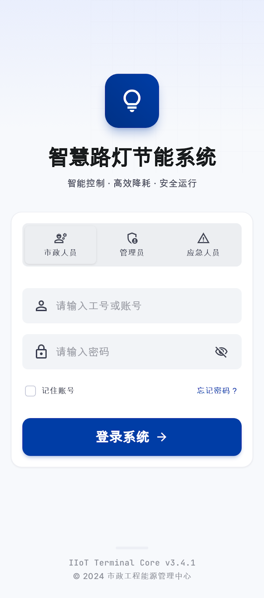
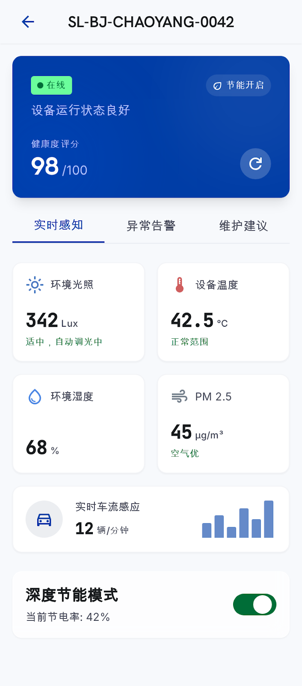
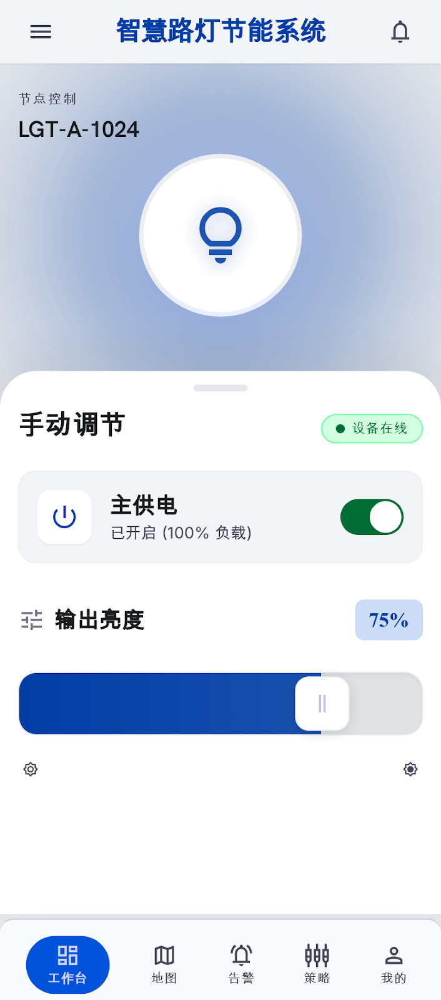
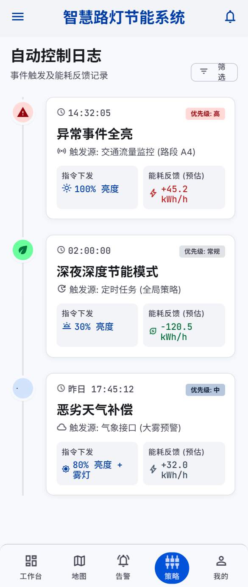
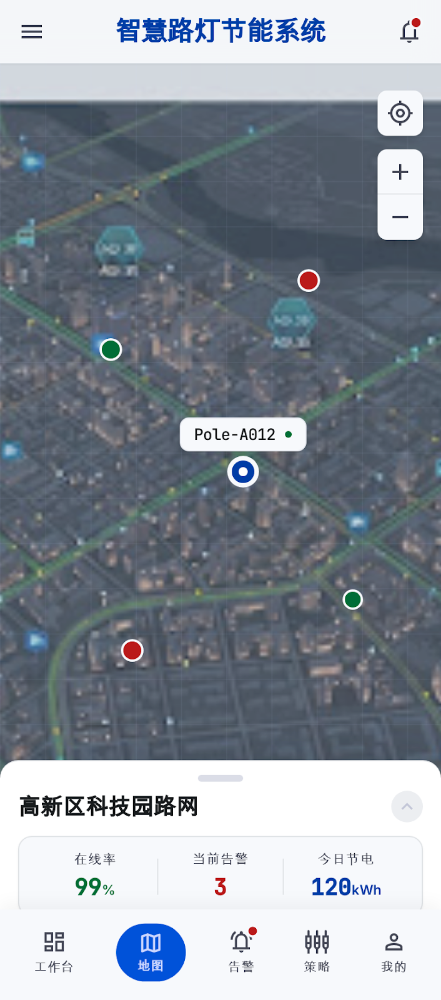
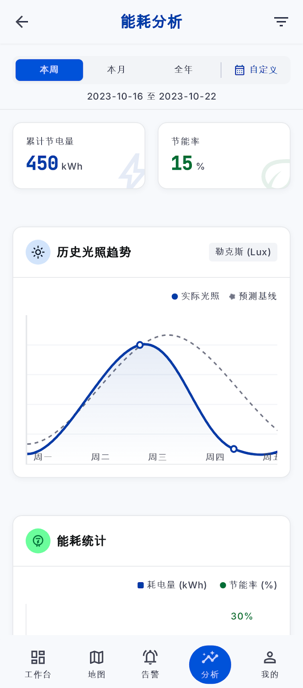
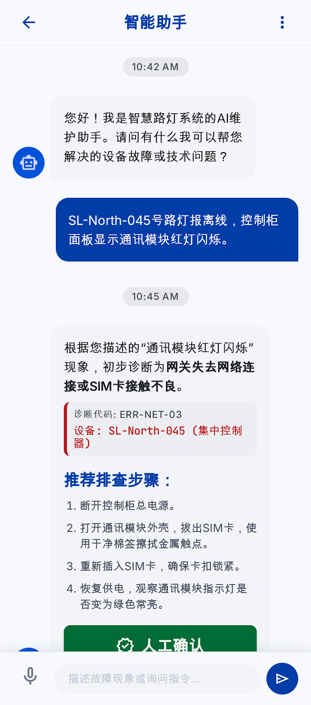
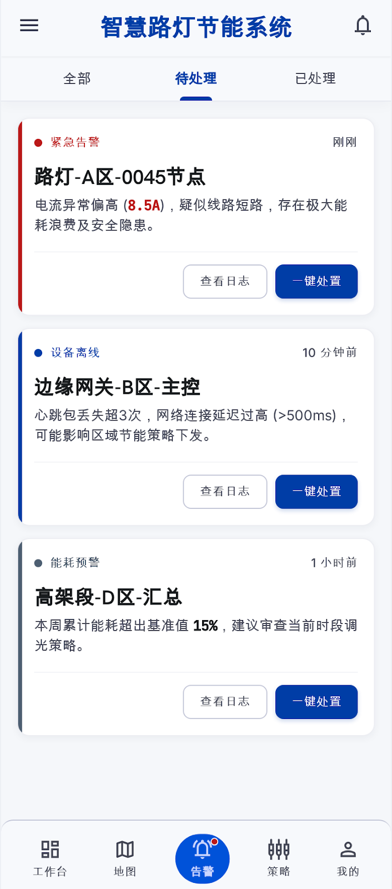

# 移动端接口文档

> 本文档涵盖移动端第一阶段四个模块（数字孪生、数据报表、设备管理、智能助手）+ 登录认证 + 告警中心的所有接口。
> 配套参考：《移动端开发参考.md》（服务地址、认证方式、MQTT、数据库等配置信息）

---

## 一、通用说明

### 1.1 接口地址

当前阶段通过 natapp 隧道访问（详见《移动端开发参考.md》）：

```
{{BASE_URL}}
```

### 1.2 统一响应格式

```json
{
  "code": 200,
  "msg": "success",
  "data": { ... }
}
```

| code | 含义 |
|------|------|
| 200 | 成功 |
| 400 | 参数错误 |
| 401 | 未登录 / Token 过期 |
| 403 | 无权限 |
| 404 | 资源不存在 |
| 409 | 数据冲突（如设备编号重复） |
| 500 | 服务器错误 |

### 1.3 认证方式

除白名单路径外，所有接口需在请求头携带 JWT Token：

```
Authorization: Bearer <token>
```

Token 通过登录接口获取，有效期 24 小时，过期后需重新登录。

### 1.4 分页请求

POST 分页接口请求体：

```json
{
  "page": 1,
  "size": 20,
  "...其他查询条件": ""
}
```

GET 分页接口 URL 参数：

```
?pageNum=1&pageSize=20&keyword=xxx
```

分页响应：

```json
{
  "records": [ ... ],
  "total": 100,
  "size": 20,
  "current": 1,
  "pages": 5
}
```

---

## 二、认证模块

对应原型图：`loginscreen.png`



### 2.1 登录

```
POST /api/auth/login
```

**请求体：**

```json
{
  "username": "admin",
  "password": "admin123"
}
```

**响应 data：**

| 字段 | 类型 | 说明 |
|------|------|------|
| token | String | JWT Token，后续请求携带 |
| username | String | 用户名 |
| roleCode | String | 角色编码 |
| permissions | String[] | 权限码列表 |
| menus | Array | 可见菜单树 |

**测试账号：**

| 用户名 | 密码 | 角色 |
|--------|------|------|
| admin | admin123 | SUPER_ADMIN |

### 2.2 获取当前用户信息

```
GET /api/auth/me
Authorization: Bearer <token>
```

返回与登录接口相同的 data 结构，用于 App 启动时校验 Token 是否有效。

---

## 三、设备管理模块

对应原型图：`devicedetailscreen.png`、`manualcontrolscreen.png`、`controllogscreen.png`





### 3.1 设备列表（POST 方式，推荐）

```
POST /api/devices/list
```

**请求体：**

| 参数 | 类型 | 必填 | 说明 |
|------|------|------|------|
| page | int | 否 | 页码，默认 1 |
| size | int | 否 | 每页条数，默认 20 |
| deviceId | String | 否 | 设备编号（精确匹配） |
| name | String | 否 | 设备名称（模糊匹配） |
| area | String | 否 | 区域名称（精确匹配） |
| areaId | Long | 否 | 区域ID |
| status | Integer | 否 | 状态：0-停用 1-在线 2-离线 3-异常 |
| enabled | Boolean | 否 | 是否启用 |
| healthScoreMin | BigDecimal | 否 | 健康评分下限 |
| healthScoreMax | BigDecimal | 否 | 健康评分上限 |

**示例：**

```json
{
  "page": 1,
  "size": 20,
  "area": "A区",
  "status": 1
}
```

**响应 data.records 主要字段：**

| 字段 | 类型 | 说明 |
|------|------|------|
| id | Long | 主键 |
| deviceId | String | 设备编号 |
| name | String | 设备名称 |
| area | String | 所属区域 |
| areaId | Long | 区域ID |
| location | String | 安装位置（经纬度字符串） |
| status | Integer | 0-停用 1-在线 2-离线 3-异常 |
| healthScore | BigDecimal | 健康评分 0-100 |
| lastHeartbeatAt | String | 最后心跳时间 ISO 格式 |
| latestData | String | 最新遥测快照 JSON 字符串 |
| firmwareVersion | String | 固件版本 |
| enabled | Boolean | 是否启用 |
| topicPrefix | String | MQTT 主题前缀 |

### 3.2 设备列表（GET 方式）

```
GET /api/devices/page?pageNum=1&pageSize=20&keyword=xxx&area=A区&status=1
```

| 参数 | 类型 | 说明 |
|------|------|------|
| pageNum | int | 页码，默认 1 |
| pageSize | int | 每页条数，默认 10，最大 100 |
| keyword | String | 关键词（匹配 deviceId / name / location） |
| area | String | 区域 |
| areaId | Long | 区域ID |
| status | Integer | 状态 |
| enabled | Boolean | 是否启用 |

### 3.3 设备详情

```
GET /api/devices/{deviceId}
```

返回完整的 Device 对象，字段同 3.1 响应。

### 3.4 新增设备

```
POST /api/devices
```

```json
{
  "deviceId": "SL-008",
  "name": "学院路8号灯杆",
  "area": "学院路",
  "areaId": 3,
  "location": "29.5647,106.5478",
  "status": 1,
  "enabled": true
}
```

### 3.5 编辑设备

```
PUT /api/devices/{deviceId}
```

请求体同新增（只传需要修改的字段）。

### 3.6 删除设备（软删除）

```
DELETE /api/devices/{deviceId}
```

### 3.7 批量新增设备

```
POST /api/devices/batch
```

```json
[
  { "deviceId": "SL-009", "name": "设备9", "area": "A区", "status": 1 },
  { "deviceId": "SL-010", "name": "设备10", "area": "A区", "status": 1 }
]
```

### 3.8 批量分配区域

```
PUT /api/devices/batch-area
```

```json
{
  "deviceIds": [1, 2, 3],
  "areaId": 5
}
```

---

## 四、设备健康评分

### 4.1 设备健康评分详情（实时计算）

```
GET /api/devices/{deviceId}/health
```

**响应 data：**

| 字段 | 类型 | 说明 |
|------|------|------|
| deviceId | String | 设备编号 |
| deviceName | String | 设备名称 |
| overallScore | int | 综合评分 0-100 |
| level | String | 等级：优秀/良好/一般/较差/危险 |
| levelColor | String | UI 颜色 #4caf50/#ff9800/#f44336 |
| dimensions | Array | 四个维度评分数组 |
| suggestion | String | 综合建议文案 |
| evaluatedAt | String | 评估时间 |

**dimensions 数组每项：**

| 字段 | 类型 | 说明 |
|------|------|------|
| name | String | 维度名：离线频次/通信质量/指令响应率/传感器状态 |
| score | int | 该维度分数 |
| weight | String | 权重：30%/25%/25%/20% |
| reason | String | 扣分原因，满分时为 null |

### 4.2 全局健康概览

```
GET /api/devices/health/summary
```

**响应 data：**

| 字段 | 类型 | 说明 |
|------|------|------|
| totalDevices | int | 设备总数 |
| healthyCount | int | 健康数 |
| warningCount | int | 警告数 |
| criticalCount | int | 严重数 |
| averageScore | int | 平均健康分 |
| list | Array | 每台设备的 score + level |

---

## 五、设备遥测数据

### 5.1 最新遥测数据

```
GET /api/telemetry/latest/{deviceId}
```

**响应 data：**

| 字段 | 类型 | 说明 |
|------|------|------|
| deviceId | String | 设备编号 |
| name | String | 设备名称 |
| area | String | 所属区域 |
| status | Integer | 设备状态 |
| healthScore | BigDecimal | 健康分 |
| lastHeartbeatAt | String | 最后心跳时间 |
| data | Object | 遥测数据对象 |

**data 对象字段：**

| 字段 | 类型 | 说明 |
|------|------|------|
| illuminance | Number | 光照度 (lux) |
| temperature | Number | 温度 (°C) |
| humidity | Number | 湿度 (%) |
| pm25 | Number | PM2.5 |
| aqi | Number | AQI |
| pir | Number | 人体感应：0-无人 1-有人 |
| traffic | Number | 车流量 |

### 5.2 遥测历史（分页）

```
POST /api/telemetry/history
```

**请求体：**

```json
{
  "deviceId": "SL-001",
  "collectedAtFrom": "2026-07-06T00:00:00",
  "collectedAtTo": "2026-07-06T23:59:59",
  "page": 1,
  "size": 50
}
```

返回 Telemetry 分页数据，每条记录含 illuminance、temperature、humidity、pm25、aqi、pir、traffic、collectedAt 等字段。

---

## 六、设备控制模块

对应原型图：`manualcontrolscreen.png`、`controllogscreen.png`



### 6.1 下发控制指令

```
POST /api/devices/{deviceId}/control
```

**请求体：**

```json
{
  "action": "ON",
  "brightness": 80
}
```

| action 值 | 说明 | brightness 是否必填 |
|-----------|------|:---:|
| ON | 开灯 | 否 |
| OFF | 关灯 | 否 |
| DIMMING | 调光 | **是**（0-100） |

**手动锁定机制**：手动控制后，AI 自动策略引擎会在 30 分钟内跳过此设备，防止自动策略覆盖人工干预。

### 6.2 解除手动锁定

```
DELETE /api/devices/{deviceId}/manual-lock
```

解除锁定后设备恢复 AI 自动控制。

### 6.3 控制历史

```
GET /api/devices/{deviceId}/control-history?page=1&size=10
```

**响应 records 主要字段：**

| 字段 | 类型 | 说明 |
|------|------|------|
| action | String | 指令：ON / OFF / DIMMING(80) |
| brightness | Integer | 亮度值 |
| source | String | MANUAL / AUTO |
| operator | String | 操作人 |
| status | String | SENT / SUCCESS / FAILED |
| issuedAt | String | 下发时间 |
| ackAt | String | 设备确认时间 |
| resultDetail | String | 执行反馈 |

---

## 七、数字孪生（仪表盘）模块

对应原型图：`mapscreen.png`



### 7.1 统计概览

```
GET /api/dashboard/stats
```

**响应 data：**

| 字段 | 类型 | 说明 |
|------|------|------|
| totalDevices | long | 设备总数 |
| onlineDevices | long | 在线设备数 |
| onlineRate | String | 在线率 "85.2" |
| alertCount | long | 未处理告警数 |
| energySavingRate | BigDecimal | 节能率 (%) |
| todayEnergy | BigDecimal | 今日总能耗 (kWh) |

### 7.2 能耗趋势（今日 vs 上周同期）

```
GET /api/dashboard/energy-trend
```

**响应 data：**

| 字段 | 类型 | 说明 |
|------|------|------|
| labels | String[] | 24 小时标签 ["00:00", "01:00", ...] |
| current | Double[] | 今日各时段能耗 |
| lastWeek | Double[] | 上周同期各时段能耗 |

### 7.3 分区设备状态

```
GET /api/dashboard/districts
```

**响应 data 数组每项：**

| 字段 | 类型 | 说明 |
|------|------|------|
| name | String | 区域名称 |
| online | long | 在线数 |
| offline | long | 离线数 |
| warning | long | 异常数 |
| disabled | long | 停用数 |

### 7.4 边缘 AI 决策状态

```
GET /api/dashboard/edge-status
```

| 字段 | 类型 | 说明 |
|------|------|------|
| totalDecisions | int | 边缘决策总数 |
| hitCount | int | 命中次数 |
| lastSimulatedAt | String | 最近一次模拟时间 |
| enabled | boolean | 是否启用 |

### 7.5 边缘 AI 最近决策

```
GET /api/dashboard/edge/recent
```

返回最近 20 条边缘决策记录，每条含 deviceId、matchedPolicy、actionTaken、result、createTime。

### 7.6 手动触发边缘决策模拟

```
POST /api/dashboard/edge/trigger
```

触发后返回 7.4 中 edge-status 结构的实时数据。

---

## 八、数据报表模块

对应原型图：`energyanalysisscreen.png`



### 8.1 年度能耗统计

```
GET /api/dashboard/energy/yearly-stats?year=2026
```

**响应 data：**

| 字段 | 类型 | 说明 |
|------|------|------|
| year | int | 年份 |
| totalKwh | BigDecimal | 年度总能耗 (kWh) |
| savedKwh | BigDecimal | 年度节省量 (kWh) |
| carbonReductionKg | BigDecimal | 碳减排量 (kg CO2) |
| avgOnlineRate | String | 平均在线率 |
| lastYear | Object | 去年数据 `{ totalKwh, avgOnlineRate }` |

### 8.2 月度能耗统计（12 个月）

```
GET /api/dashboard/energy/monthly?year=2026
```

**响应 data：**

| 字段 | 类型 | 说明 |
|------|------|------|
| year | int | 年份 |
| months | String[] | ["1月", "2月", ..., "12月"] |
| consumption | BigDecimal[] | 每月实际能耗 |
| savings | BigDecimal[] | 每月节省量 |

### 8.3 分区能耗占比

```
GET /api/dashboard/energy/district?year=2026
```

**响应 data 数组每项：**

| 字段 | 类型 | 说明 |
|------|------|------|
| name | String | 区域名称 |
| value | BigDecimal | 该区域年度能耗 (kWh) |

---

## 九、智能助手模块

对应原型图：`smartassistantscreen.png`



### 9.1 对话问答

```
POST /api/assistant/chat
```

**请求体：**

```json
{
  "message": "灯不亮怎么办"
}
```

**响应 data：**

| 字段 | 类型 | 说明 |
|------|------|------|
| type | String | KNOWLEDGE_QA（知识问答）/ THRESHOLD_UPDATED（参数已修改） |
| content | String | AI 回复文本 |
| action | Object | 当 type=THRESHOLD_UPDATED 时，包含 name/policyId/policyName 及修改的参数 |

**自然语言调参示例：**
- "把阈值调到30"
- "亮度调到60%"
- "灯不亮怎么办"
- "如何优化节能策略"

### 9.2 一键诊断

```
POST /api/assistant/diagnose
```

**请求体：**

```json
{
  "deviceId": "SL-001",
  "question": "最近频繁离线是什么原因"
}
```

返回结构同 9.1 聊天响应，AI 会结合设备最新遥测、告警、控制历史做综合分析。

---

## 十、告警中心模块（配套）

对应原型图：`alarmcenterscreen.png`



> 注：告警中心不在第一阶段四个模块中，但原型图有此页面，移动端可按需实现。

### 10.1 告警列表

```
POST /api/alarms/list
```

**请求体：**

```json
{
  "deviceId": "SL-001",
  "type": "OFFLINE",
  "level": "HIGH",
  "status": "ACTIVE",
  "page": 1,
  "size": 20
}
```

**告警类型 (type)：** OFFLINE（离线）、HIGH_TEMP（高温）、LOW_HEALTH（健康分低）等

**告警级别 (level)：** HIGH、MEDIUM、LOW

**告警状态 (status)：** ACTIVE（活跃）、ACKNOWLEDGED（已确认）、RESOLVED（已恢复）

### 10.2 告警详情

```
GET /api/alarms/{id}
```

### 10.3 处理/确认告警

```
PUT /api/alarms/{id}/handle
```

```json
{
  "remark": "设备已恢复正常"
}
```

### 10.4 告警统计

```
GET /api/alarms/stats
```

返回按级别、类型、状态分组的统计数量。

### 10.5 告警趋势

```
GET /api/alarms/trend?days=7
```

返回最近 N 天每日告警数量。

---

## 十一、原型图与接口对照表

| 原型图 | 对应模块 | 涉及接口 |
|--------|---------|---------|
| loginscreen.png | 登录认证 | 2.1 |
| devicedetailscreen.png | 设备详情 | 3.3, 4.1, 5.1 |
| manualcontrolscreen.png | 手动控制 | 6.1, 6.2 |
| controllogscreen.png | 控制历史 | 6.3 |
| energyanalysisscreen.png | 数据报表 | 8.1, 8.2, 8.3 |
| smartassistantscreen.png | 智能助手 | 9.1, 9.2 |
| mapscreen.png | 数字孪生 | 7.1, 7.2, 7.3, 7.4, 7.5, 3.1 |
| alarmcenterscreen.png | 告警中心 | 10.1, 10.2, 10.3, 10.4, 10.5 |
| strategysettingsscreen.png | 策略设置 | ⚠️ 未在第一阶段范围 |

---

## 十二、接口覆盖评估

| 模块 | 所需接口数 | 已就绪 | 缺失 |
|------|:---:|:---:|:---:|
| 登录认证 | 2 | 2 | 0 |
| 设备管理 | 8 | 8 | 0 |
| 设备健康 | 2 | 2 | 0 |
| 遥测数据 | 2 | 2 | 0 |
| 设备控制 | 3 | 3 | 0 |
| 数字孪生 | 6 | 6 | 0 |
| 数据报表 | 3 | 3 | 0 |
| 智能助手 | 2 | 2 | 0 |
| 告警中心（配套） | 5 | 5 | 0 |
| **合计** | **33** | **33** | **0** |

> **结论：当前后端 API 完整覆盖移动端第一阶段所有需求，无缺失接口。** 策略设置（strategysettingsscreen.png）是原型图中的额外页面，不在四个目标模块范围内，如需实现需额外对接 PolicyController。

---

## 十三、移动端开发注意事项

1. **图表渲染**：Dashboard 和 Analytics 中的 ECharts 图表（能耗趋势折线图、月度柱状图、分区饼图）需在移动端用对应平台图表库实现（Android: MPAndroidChart, iOS: Charts）
2. **设备地图**：mapscreen.png 中的设备分布地图需接入高德/百度地图 SDK，阶段一可先简化为列表
3. **Token 管理**：App 启动时调 `/api/auth/me` 校验 Token，过期自动跳登录页
4. **分页加载**：设备列表、遥测历史等做好上拉加载更多
5. **实时刷新**：设备详情页可每 12 秒静默刷新遥测数据；仪表盘每 45 秒刷新统计卡片
6. **远程控制反馈**：发送控制指令后，建议轮询 `/api/devices/{deviceId}/control-history` 确认执行结果
7. **接口文档**：完整 Swagger 文档可访问 `{{BASE_URL}}/doc.html`（需后端 + natapp 运行中）
